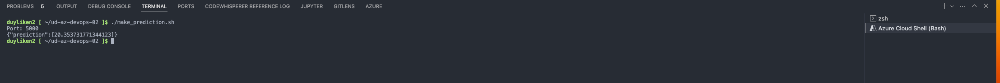
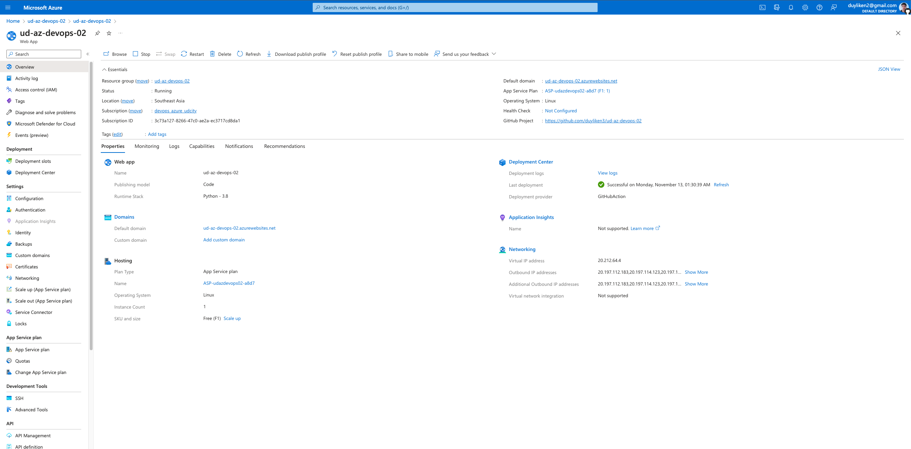
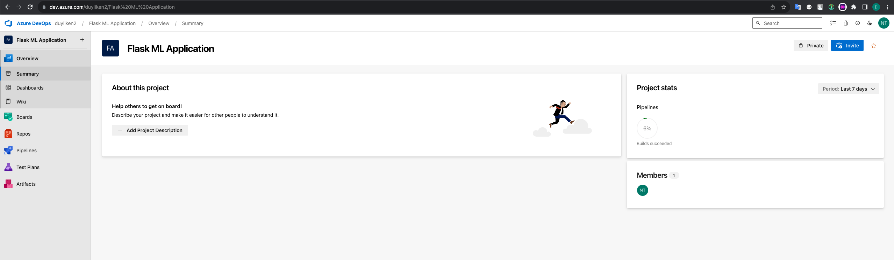
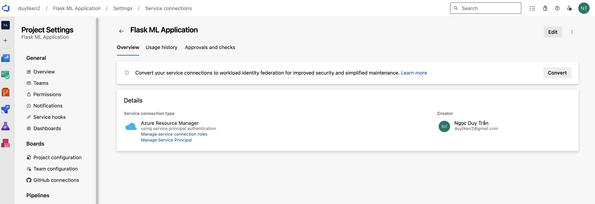
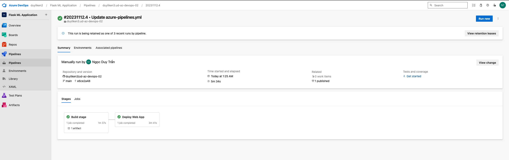
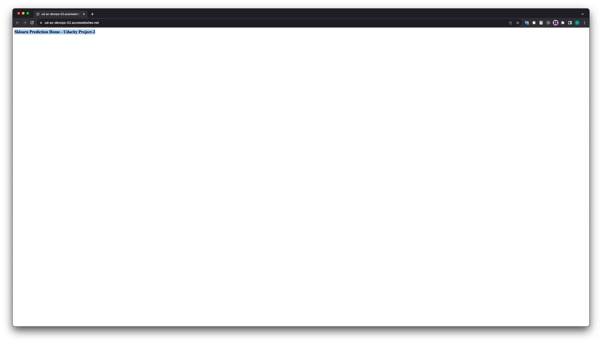

# Overview

In this project, you will build a Github repository from scratch and create a scaffolding that will assist you in performing both Continuous Integration and Continuous Delivery.  
Apply code to perform an initial lint, test, and install cycle. Next, you'll integrate this project with Azure Pipelines to enable Continuous Delivery to Azure App Service.
Apply Agile to manage project.  

## Project Plan
* Trello's board: (https://trello.com/b/exRvPs3y/udacity-devops-planing)
* Link to a spreadsheet: (https://docs.google.com/spreadsheets/d/1kxkROtY00z__KKVUVds86NM_9FsFyIEu0WNLHirhYOo/edit?usp=sharing)
## Badge

[](https://github.com/duyliken3/ud-az-devops-02/actions/workflows/main_ud-az-devops-02.yml)  
[](https://dev.azure.com/duyliken2/Flask%20ML%20Application/_build/latest?definitionId=3&branchName=main)


## Instructions

### Architectural Diagram - GitHub Actions


#### Project cloned into Azure Cloud Shell

* Configuring Github - create a ssh key
```ssh
    ssh-keygen -t rsa -b 2048 -C "your-email@gmail.com"
```

* Copy the public key to your GitHub Account -> Settings -> SSH and GPG keys


* In Azure Cloud Shell, clone your repo:

```ssh
    git clone https://github.com/duyliken3/ud-az-devops-02.git
```


* Checkout branch: feature/git-action

```ssh
    cd ud-az-devops-02
    pwd
    git checkout origin/feature/git-action
```

* Create virtual enviroment python

```ssh
    python3 -m venv ~/.venv
    source ~/.venv/bin/acitvate
```

* Passing tests that are displayed after running the `make all` command from the `Makefile`


* Github Action


### Architectural Diagram - Azure Devops pipeline


* Checkout `main` branch

```ssh
    git checkout main
```

* Passing tests that are displayed after running the `make all` command from the `Makefile`

```ssh
    make all
```

* Run app local on cloud shell

```ssh
    export FLASK_APP=app.py
    flask run
```

* Call predict api in local

```ssh
    /.make_prediction.sh
```



* In Azure Cloud Shell, run `commands.sh` create azure app service

```ssh
    /.commands.sh
```



* Setup azure devops piepline - https://dev.azure.com/  
Create a new private project.   
Create a new service connection   
Create a new pipeline base on `azure-pipelines.yml`   


* Check that the webapp is running opening his URL, example:
```ssh
    https://ud-az-devops-02.azurewebsites.net/
```


* Update the file make_predict_azure_app.sh with the webapp service end point

* Run `./make_predict_azure_app.sh`


* Log tail azure web app

```ssh
    az webapp log tail --name {webapp-name} --resource-group {resource-group-name}
```


* Loading Test, using Locust
```ssh
    ./loadingtest.sh
```


## Enhancements

* Updgrade new UI application
* Implement Cricle CI
* Traning new ML model
* Add new test case for predict function

## Demo 

Demo video

